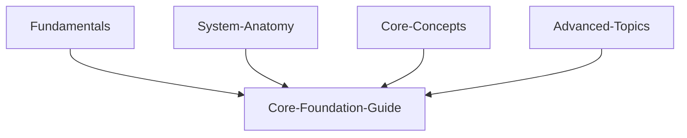

code
Markdown
<div align="center">
  <a href="https://d4n-87.github.io/Core-Foundation-Guide/">
    
  </a>
  <h1>Core Foundation Guide</h1>
  <p>
    🇮🇹 Un manuale interattivo per capire i concetti fondamentali dell'intelligenza artificiale.
    <br>
    <em>🇬🇧 An interactive manual to understand the fundamental concepts of Artificial Intelligence.</em>
  </p>
  <p>
    <strong><a href="https://d4n-87.github.io/Core-Foundation-Guide/">🚀 VAI AL SITO LIVE / GO TO THE LIVE SITE 🚀</a></strong>
  </p>
  <p>
    <a href="https://github.com/d4n-87/Core-Foundation-Guide/actions/workflows/deploy.yml">
      
    </a>
  </p>
</div>

<div align="center">

[![Stargazers][stars-shield]][stars-url]
[](https://github.com/d4N-87/Core-Foundation-Guide/releases)
[![Issues][issues-shield]][issues-url]
[![MIT License][license-shield]][license-url]
[![LinkedIn][linkedin-shield]][linkedin-url]

</div>

---

### 🇬🇧 English

Have you ever started exploring the world of open-source AI image generation with tools like ComfyUI or Stable Diffusion and felt overwhelmed by a flood of technical terms? **Checkpoint, LoRa, UNet, VAE, Conditioning...** what do they all mean?

**Core Foundation Guide** was born from this exact challenge. It's not just a dictionary, but an **interactive field manual** designed for beginners and enthusiasts who want to truly understand the building blocks of AI image generation.

This guide breaks down complex concepts into simple, easy-to-digest articles, helping you move from confusion to confidence. Whether you're trying to figure out why your images look a certain way or you just want to master the tools you're using, this is your starting point.

| 🇮🇹 Pagina iniziale / 🇬🇧 Home | 🇮🇹 Categorie / 🇬🇧 Category | 🇮🇹 Filtri / 🇬🇧 Filters | 🇮🇹 Articolo / 🇬🇧 Article |
| :---: | :---: | :---: | :---: |
|  |  |  |  |


## ⚙️ Features

*   **Interactive Content:** A dynamic and engaging way to learn complex AI topics.
*   **Multilingual Support:** Fully localized content in Italian, English, and more.
*   **Search & Filtering:** Easily find articles by keyword or category.
*   **Text-to-Speech:** Listen to any article with integrated speech synthesis.
*   **Animated Background:** A generative neural network background built with p5.js.
*   **Static & Fast:** Built with SvelteKit's static adapter for maximum performance, deployed on GitHub Pages.

## 🛠️ Tech Stack

*   **Framework:** [SvelteKit](https://kit.svelte.dev/)
*   **Language:** [TypeScript](https://www.typescriptlang.org/)
*   **Styling:** [Tailwind CSS](https://tailwindcss.com/)
*   **Animations:** [GSAP (GreenSock Animation Platform)](https://gsap.com/)
*   **Generative Graphics:** [p5.js](https://p5js.org/)

## How to Run Locally

### 📄 Prerequisites

- [Node.js](https://nodejs.org/) (version 18.x or higher is recommended)

### 💻 Installation

1.  Clone the repository:
    ```bash
    git clone https://github.com/d4n-87/Core-Foundation-Guide.git
    ```
2.  Navigate to the project directory:
    ```bash
    cd Core-Foundation-Guide
    ```
3.  Install dependencies:
    ```bash
    npm install
    ```
4.  Start the development server:
    ```bash
    npm run dev
    ```

---

<br>

### 🇮🇹 Italiano

Hai mai iniziato a esplorare il mondo della generazione di immagini AI open-source con strumenti come ComfyUI o Stable Diffusion, sentendoti sopraffatto da una valanga di termini tecnici? **Checkpoint, LoRa, UNet, VAE, Conditioning...** cosa significano?

**Core Foundation Guide** nasce proprio da questa sfida. Non è un semplice dizionario, ma un **manuale interattivo** pensato per principianti e appassionati che vogliono capire davvero i mattoncini fondamentali che compongono la generazione di immagini AI.

Questa guida scompone i concetti complessi in articoli semplici e facili da digerire, aiutandoti a passare dalla confusione alla sicurezza. Che tu stia cercando di capire perché le tue immagini hanno un certo aspetto o semplicemente desideri padroneggiare gli strumenti che usi, questo è il tuo punto di partenza.

## ⚙️ Funzionalità

*   **Contenuti Interattivi:** Un modo dinamico e coinvolgente per apprendere argomenti complessi di AI.
*   **Supporto Multilingua:** Contenuti completamente localizzati in Italiano, Inglese e altre lingue.
*   **Ricerca e Filtri:** Trova facilmente gli articoli per parola chiave o categoria.
*   **Sintesi Vocale:** Ascolta qualsiasi articolo grazie alla sintesi vocale integrata.
*   **Sfondo Animato:** Uno sfondo generativo a rete neurale costruito con p5.js.
*   **Statico e Veloce:** Costruito con l'adattatore statico di SvelteKit per le massime prestazioni, pubblicato su GitHub Pages.

## 🛠️ Tecnologie Utilizzate

*   **Framework:** [SvelteKit](https://kit.svelte.dev/)
*   **Linguaggio:** [TypeScript](https://www.typescriptlang.org/)
*   **Stile:** [Tailwind CSS](https://tailwindcss.com/)
*   **Animazioni:** [GSAP (GreenSock Animation Platform)](https://gsap.com/)
*   **Grafica Generativa:** [p5.js](https://p5js.org/)

## Come Eseguire in Locale

### 📄 Prerequisiti

- [Node.js](https://nodejs.org/) (è raccomandata la versione 18.x o superiore)

### 💻 Installazione

1.  Clona il repository:
    ```bash
    git clone https://github.com/d4n-87/Core-Foundation-Guide.git
    ```
2.  Entra nella cartella del progetto:
    ```bash
    cd Core-Foundation-Guide
    ```
3.  Installa le dipendenze:
    ```bash
    npm install
    ```
4.  Avvia il server di sviluppo:
    ```bash
    npm run dev
    ```

---



---

## 📈 Aggiornamenti Futuri / Future Updates

<p>🇮🇹 Verranno aggiunti periodicamente nuovi argomenti AI.</p>
<p>🇬🇧 New AI topics will be added periodically.</p>

---

## ❤️ Supporta il Progetto / Support the Project

<p>🇮🇹 Se Core-Foundation-Guide ti è stato utile, considera di supportare il progetto. Ogni contributo aiuta a mantenere il sito attivo e a finanziare lo sviluppo di nuove funzionalità!</p>
<p>🇬🇧 If you found Core-Foundation-Guide useful, please consider supporting the project. Every contribution helps keep the site running and funds the development of new features!</p>

<p align="center">
  <a href="https://www.patreon.com/d4N87" target="_blank"></a>
    
  <a href="https://paypal.me/d4n87?country.x=IT&locale.x=it_IT" target="_blank"></a>
</p>

# Star History

[](https://www.star-history.com/#d4N-87/Core-Foundation-Guide&Date)

---

## 📄 Licenza / License

<p>🇮🇹 Questo progetto è rilasciato sotto la Licenza MIT.</p>
<p>🇬🇧 This project is released under the MIT License.</p>

<!-- Link di Riferimento per i Badge (vanno alla fine del file) -->
[stars-shield]: https://img.shields.io/github/stars/d4N-87/Core-Foundation-Guide?style=for-the-badge
[stars-url]: https://github.com/d4N-87/Core-Foundation-Guide/stargazers
[issues-shield]: https://img.shields.io/github/issues/d4N-87/Core-Foundation-Guide?style=for-the-badge
[issues-url]: https://github.com/d4N-87/Core-Foundation-Guide/issues
[license-shield]: https://img.shields.io/github/license/d4N-87/Core-Foundation-Guide?style=for-the-badge
[license-url]: https://github.com/d4N-87/Core-Foundation-Guide/blob/main/LICENSE
[linkedin-shield]: https://img.shields.io/badge/-LinkedIn-black.svg?style=for-the-badge&logo=linkedin&colorB=555
[linkedin-url]: https://www.linkedin.com/in/danielenofi
